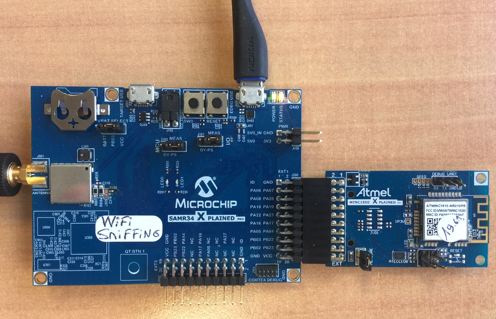
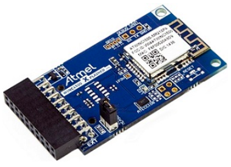
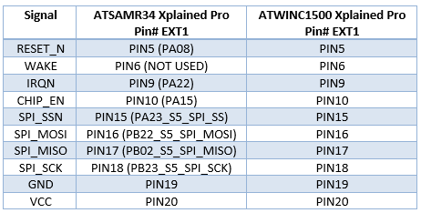
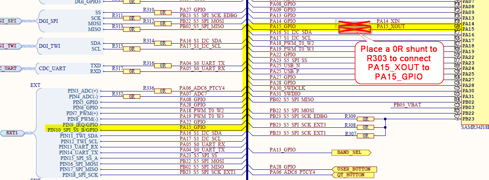
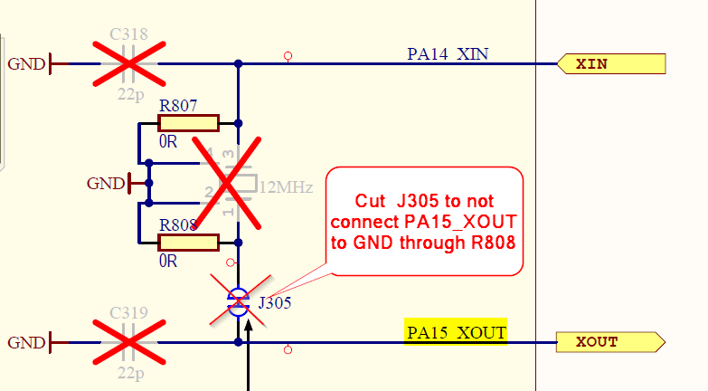
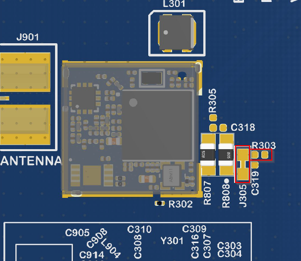
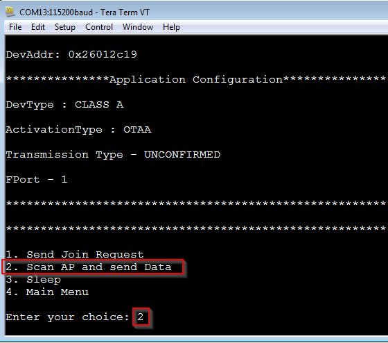
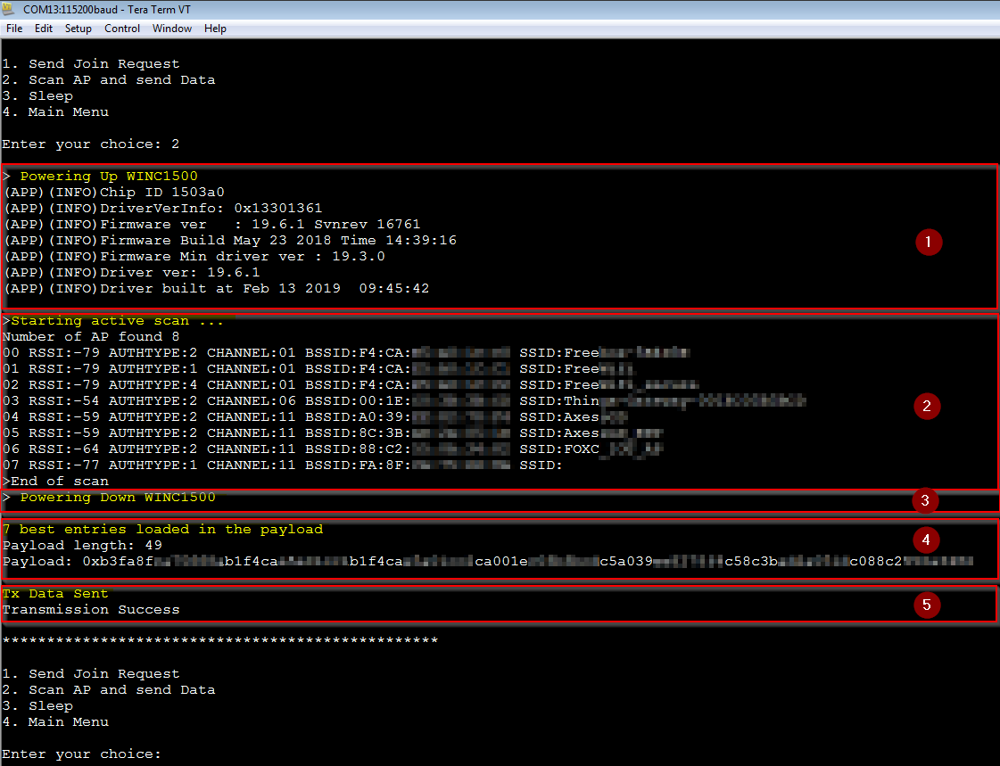
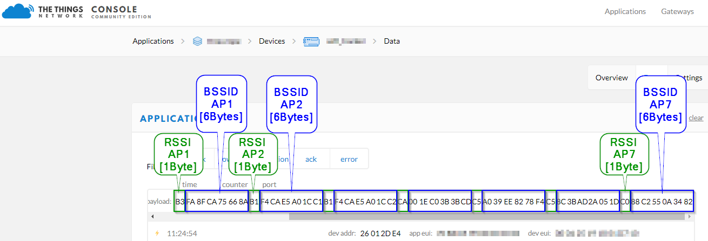

# ATSAMR34_LORAWAN_WIFI_AP_SCAN
> “Wireless Made Easy!" - Adding WiFi Sniffing to an existing LoRaWAN Application

<p>
<a href="https://www.microchip.com" target="_blank">

</a>
</p>

## ⚠ Disclaimer

<p><span style="color:red"><b>
Subject to your compliance with these terms, you may use Microchip software and any derivatives exclusively with Microchip products. It is your responsibility to comply with third party license terms applicable to your use of third party software (including open source software) that may accompany Microchip software.<br>
THIS SOFTWARE IS SUPPLIED BY MICROCHIP "AS IS". NO WARRANTIES, WHETHER EXPRESS, IMPLIED OR STATUTORY, APPLY TO THIS SOFTWARE, INCLUDING ANY IMPLIED WARRANTIES OF NON-INFRINGEMENT, MERCHANTABILITY, AND FITNESS FOR A PARTICULAR PURPOSE.<br>
IN NO EVENT WILL MICROCHIP BE LIABLE FOR ANY INDIRECT, SPECIAL, PUNITIVE, INCIDENTAL OR CONSEQUENTIAL LOSS, DAMAGE, COST OR EXPENSE OF ANY KIND WHATSOEVER RELATED TO THE SOFTWARE, HOWEVER CAUSED, EVEN IF MICROCHIP HAS BEEN ADVISED OF THE POSSIBILITY OR THE DAMAGES ARE FORESEEABLE. TO THE FULLEST EXTENT ALLOWED BY LAW, MICROCHIP'S TOTAL LIABILITY ON ALL CLAIMS IN ANY WAY RELATED TO THIS SOFTWARE WILL NOT EXCEED THE AMOUNT OF FEES, IF ANY, THAT YOU HAVE PAID DIRECTLY TO MICROCHIP FOR THIS SOFTWARE.
</span></p></b>

> Interact with your peers about this software in [LoRa Forum](https://www.microchip.com/forums/f512.aspx).

## Abstract

**Based on LoRaWAN Mote Application generated from ASFv3, this sample code demonstrates how to transmit nearby Access Point data over the LoRaWAN network.**



## Sample Applications

[Clone/Download](https://docs.github.com/en/free-pro-team@latest/github/creating-cloning-and-archiving-repositories/cloning-a-repository) the current repo to get the software.

## A la carte

1. [Material required](#step1)
2. [Software](#step2)
3. [Hardware setup](#step3)
4. [LoRaWAN Mote Application + WiFi Sniffing](#step4)
5. [Provisioning the LoRaWAN activation parameters](#step5)
6. [Upgrading WINC1500 with 19.6.1 Firmware](#step6)
7. [Configuring the WiFi AP Scan](#step7)
8. [WiFi Usage for Scanning](#step8)
6. [Run the demo](#step9)

## Material required <a name="step1"></a>

Purchase the <a href="https://www.microchip.com/DevelopmentTools/ProductDetails/ATWINC1500-XPRO" target="_blank">ATWINC1500 Xplained Pro board</a>
</br>

</br>

> For this tutorial, the ATWINC1500 module is loaded with Firmware version 19.6.1.

Purchase the <a href="https://www.microchip.com/Developmenttools/ProductDetails/DM320111" target="_blank">SAM R34 Xplained Pro Evaluation Kit</a>
</br>

</br>

OR

Purchase the <a href="https://www.microchip.com/DevelopmentTools/ProductDetails/PartNO/EV23M25A" target="_blank">WLR089U0 Xplained Pro Evaluation Kit</a>
</br>

</br>

Purchase a LoRa(r) Gateway from <a href="https://www.thethingsindustries.com/technology/hardware#gateway" target="_blank">The Things Industries</a>
</br>

</br>

## Software <a name="step2"></a>

- Download and install [Microchip Studio 7.0 IDE](https://www.microchip.com/mplab/microchip-studio).
- Open Microchip Studio 7.0 IDE.
- From **Tools - > Extensions and updates**, install Advanced Software Framework (ASFv3) v3.49.1 release or upper release.
- Restart Microchip Studio

- Download and install a serial terminal program like [Tera Term](https://osdn.net/projects/ttssh2/releases/).

## Hardware setup <a name="step3"></a>

To demonstrate WiFi Sniffing over LoraWAN Network by connecting SAMR34-Xpro or WLR089U0-Xpro and ATWINC1500-Xpro, the connection is pretty straightforward through the EXT1 interface.



To get more information on the WINC1500 MCU Interface, follow this link:
http://microchipdeveloper.com/wf:atwinc1500-mcu-interfacing

If you are using a WLR089U0 Xplained Pro board, no hardware modification is required on the board.

If you have a ATSAMR34-Xpro Rev3 board (flip the board to check the revision), the EXT1_PIN10 marked PA23 on silkscreen is actually net to PA15.
General recommandation is to double check with the schematics of the board which is available in the Chip Down Design Package: 
https://www.microchip.com/wwwproducts/en/ATSAMR34J18

By default on the ATSAMR34-Xpro board Rev3, the pin PA15 of the chip is not routed to EXT1 connector. However, in order to perform power down mode of the ATWINC1500, you need to made this pin available over the EXT1_PIN10 connector. 
With this change, the ATSAMR34 device will be able to drive the PIN10 of the WINC1500-Xro board. This pin corresponds to the CHIP_EN signal of the ATWINC1500 device.
High level on CHIP_EN pin enables the ATWINC1500 module and low level places module in Power-Down mode.
To be able to drive the ATWINC1500 CHIP_EN pin from the ATSAMR34 device, perform the following hardware modification on ATSAMR34-Xpro board:
- R303: Place a 0R Shunt
- J305: Cut the shunt





- In order to connect in LoRaWAN, you will need to be in range of your gateway. If you don’t have gateway, check the world map (https://www.thethingsnetwork.org/map) to see if your local community has gateway deployed around your location.
- Plug the antennas and always make sure you have the antennas plugged to your boards before powering it up. </br>
- Connect the ATWINC1500-Xpro extension board to the EXT1 connector of the ATSAMR34-Xpro board. </br>
- Connect the board to the PC through the micro-USB cables. </br>
USB cable must be connected to the EDBG USB connectors of the ATSAMR34 kit.
- Wait for USB driver installation and COM ports mounting. The USB ports powers the board and enables the user to communicate with the kits. </br>
- Launch Tera Term program and configure the serial ports mounted with: 115200 bps, 8/N/1 </br>

## LoRaWAN Mote Application + WiFi Sniffing<a name="step4"></a>

This project integrates the Microchip LoRaWAN Stack (MLS) Software API which provide an interface to the different software modules. </br></br>
This application is based on LoRaWAN Mote Application generated from ASFv3 and already contains the drivers required to interface the ATWINC1500 device (PORT, EXTINT, SPI, etc...).

The application has been modified to perform the following steps on demand: 

- Scan the nearby WiFi Access Point
- Select the two best signal strength from the list of APs discovered
- Transmit the payload containing RSSI level and BSSID (Broadcast MAC Address) of the Access Points selected through the LoRaWAN protocol to the network server.

It uses UART serial interface with 115200 bps 8N1 configuration and the UART is used to display the menu options. The user input is provided through keyboard.

## Provisioning the LoRaWAN activation parameters<a name="step5"></a>

- In Microchip Studio 7 IDE
- Open this project
- To activate your ATSAMR34 Xplained Pro board on a LoRa Network Server, you will be using the OTAA activation procedure. The OTAA method requires the following parameters to be embedded into the LoRaWAN Mote Application:
  </br>- AppEUI : Copy/Paste from your Network Server
  </br>- AppKey: Copy/Paste from your Network Server
  </br>- DevEUI: Serialized (Embedded) in the EDBG chip of the ATMSAMR34 Xplained Pro evaluation kit
</br></br></br>
The LoRaWAN Mote Application provides configurable parameters such as OTAA credentials in conf_app.h file. This file is available at <your project folder>/src/config.
- To provision your device, perform the following steps.
- From the "Solution Explorer" pane, expand the /src/config folders.
- Open the conf_app.h file.
The file contains the possible configuration related to the LoRaWAN Mote Application.
- Modify the values of the DEMO_APPLICATION_EUI and DEMO_APPLICATION_KEY macros with the AppEUI and AppKey you've collected from your Network Server.
```
	/* OTAA Join Parameters */
	#define DEMO_DEVICE_EUI                         {0xde, 0xaf, 0xfa, 0xce, 0xde, 0xaf, 0xfa, 0xce}
	#define DEMO_APPLICATION_EUI                    {0x00, 0x00, 0x00, 0x00, 0x00, 0x00, 0x00, 0x05}
	#define DEMO_APPLICATION_KEY                    {0x00, 0x00, 0x00, 0x00, 0x00, 0x00, 0x00, 0x00, 0x00, 0x00, 0x00, 0x00, 0x00, 0x00, 0x00, 0x05}
```
- By default, the LoRaWAN Mote Application uses the embedded DevEUI from the EDBG chip. You can use your own DevEUI by changing the value of the EDBG_EUI_READ macro located in the symbols definition and in conf_board.h file. Make sure the DevEUI is the same on both side: end-device and network server.

conf_board.h file:

	/* TODO: If Board is having EDBG with DEV_EUI flashed in
	Userpage Enable this Macro otherwise make it as 0 */
	#define EDBG_EUI_READ      1

## Upgrading WINC1500 with 19.6.1 Firmware<a name="step6"></a>

This sample application has been tested with WINC1500 Firmware v19.6.1.
Make sure your WINC1500 is loaded with the same firmware. The host driver has to fit with the firmware running on the WINC1500.

During init., the WINC1500 application is checking the Firmware Vs Driver matching and should display the following information:
```
	(APP)(INFO)Chip ID 1503a0
	(APP)(INFO)DriverVerInfo: 0x13301361
	(APP)(INFO)Firmware ver   : 19.6.1 Svnrev 16761
	(APP)(INFO)Firmware Build May 23 2018 Time 14:39:16
	(APP)(INFO)Firmware Min driver ver : 19.3.0
	(APP)(INFO)Driver ver: 19.6.1
	(APP)(INFO)Driver built at Feb 13 2019  09:45:42
```

## Configuring the WiFi AP Scan<a name="step7"></a>

This application provides configurable parameters related to the WiFi scanning.
There are two methods of scanning for active WiFi access points.
- Passive scan which turn the receiver ON and listen on each channel for the beacon.
This mode is completely anonymous. The scan is completely passive and nothing is transmitted from the WiFi device.
Most of the access points transmit beacon frames every ~100ms. So, while passive scanning, to ensure no beacons are missed, the WINC1500 device has to listen for at least 200 - 300ms per channel.
Depending the region, you can have 12 channels (or 14 in some areas) in the 2.4GHz band so a full scan would take 300 x 12 = 3.6 seconds.
During this time, the receiver is active and battery life will be obviously impacted. It's an important point to consider for a battery powered application.

- Active scan which broadcast a "Who is there?" packet on each channel.
In this mode, the WiFi device transmits a probe request on the currently tuned channel. An active scan slot time is 30ms by default which means for one scan request for a specific channel, every 30ms two probe requests are sent and this is retried 3 times by default.
One active scan slot has 2 probe requests which takes ~1ms which remains 29ms for reception.

The power requirement for Active scan is much lower - after the initial probe request, the adapter only listens for a fraction of time compared to a passive scan.
Thereby active scan is using to increase the battery life.

- To configure the WiFi AP Scan, perform the following steps.
- From the "Solution Explorer" pane, expand the /src/config folders.
- Open the conf_app.h file.
The file contains the possible configuration related to the WiFi AP Scan.

```
	/* This macro defines the WIFI AP SCAN MODE */
	#define PASSIVE_SCAN	1
	#define ACTIVE_SCAN		2
	#define DEMO_AP_SCAN_MODE	ACTIVE_SCAN

	/* This macro defines the time in ms that passive scan is listening for beacons on each channel per one slot */
	#define DEMO_PASSIVE_SCAN_TIMEOUT	300

	/* This macro defines the channel(s) to scan */
	#define DEMO_CHANNEL_TO_SCAN	M2M_WIFI_CH_ALL
```

## WiFi Usage for Scanning<a name="step8"></a>

The drivers of WINC1500 device are based on events.
The m2m_wifi_handle_events() function has to be called periodicaly in the main loop in order to receive the events that are to be handled by the callback functions implemented by the application. 
This function is responsible for handling interrupts received from the WINC firmware.
```
	while (1)
	{
		m2m_wifi_handle_events(NULL) ;
		...
		..
		.
	}
```

To use the WINC1500 device, the module has be awake and the WiFi driver has to be initialized with data and status callbacks.

WINC1500 has a serial flash. On boot-up, the code is copied from flash to RAM and executed from RAM.
After the completion of Initialization (~150ms), the chip will be ready to start the scanning on host MCU’s request.
```
	/*********************************************************************//**
	\brief    Initialize the WiFi device
	*************************************************************************/
	void wifi_init(void)
	{
		/* Initialize WiFi */
		tstrWifiInitParam param ;
		int8_t ret ;
	//	printf(STRING_HEADER) ;
		// Initialize the BSP.
		nm_bsp_init();
		// Initialize Wi-Fi parameters structure.
		memset((uint8_t *)&param, 0, sizeof(tstrWifiInitParam));
		// Initialize Wi-Fi driver with data and status callbacks.
		param.pfAppWifiCb = wifi_event_cb ;
		ret = m2m_wifi_init(&param);
		if (M2M_SUCCESS != ret)
		{
			printf("main: m2m_wifi_init call error!(%d)\r\n", ret) ;
			while (1){} ;
		}
	}
```

Optionally, the scan parameters can be loaded for configuring the behavior of the WINC IC's network scanning functions.
The m2m_wifi_set_scan_options() function sets the time configuration parameters for the scan operation.
```
		// Configure Scan Parameters
		tstrM2MScanOption strScanOptions ;
		strScanOptions.u8NumOfSlot = 1 ; //M2M_SCAN_DEFAULT_NUM_SLOTS;
		strScanOptions.u8ProbesPerSlot = M2M_SCAN_DEFAULT_NUM_PROBE ;
		strScanOptions.u8SlotTime = M2M_SCAN_DEFAULT_SLOT_TIME ;
		strScanOptions.s8RssiThresh = -60 ;
		m2m_wifi_set_scan_options(&strScanOptions) ;
```

According to the WiFi AP Scan configuration set in conf_app.h file, a WiFi passive/or active scan is performed by calling the corresponding API. 
```
	#if (DEMO_AP_SCAN_MODE == PASSIVE_SCAN)
			printf("\n>Starting passive scan ...\r\n") ;
			m2m_wifi_request_scan_passive(DEMO_CHANNEL_TO_SCAN, DEMO_PASSIVE_SCAN_TIMEOUT) ;
	#else
			printf("\n>Starting active scan ...\r\n") ;
			m2m_wifi_request_scan(DEMO_CHANNEL_TO_SCAN) ;
	#endif
```

Scan statuses are delivered to the application via the WiFi event callback (here wifi_event_cb) in three stages.
- The first step involves the event M2M_WIFI_RESP_SCAN_DONE which provides the number of detected access points.
- The application then read the list of access points via multiple calls to the asynchronous m2m_wifi_req_scan_result() API.
- For each call to this function, the application will receive the event M2M_WIFI_RESP_SCAN_RESULT.

The following code snippet demonstrates the handling of the events received in response. The code has been intentionally reduced here for the explanation. 
The original application contains the filtering to select the best WiFi networks from the APs discovered.
```
	void wifi_event_cb(uint8 u8WiFiEvent, void * pvMsg)
	{
		static uint8	u8ScanResultIdx = 0 ;
		switch(u8WiFiEvent)
		{
			case M2M_WIFI_RESP_SCAN_DONE:
			{
				tstrM2mScanDone	*pstrInfo = (tstrM2mScanDone*)pvMsg ;
				printf("Num of AP found %d\n",pstrInfo->u8NumofCh) ;
				if(pstrInfo->s8ScanState == M2M_SUCCESS)
				{
					u8ScanResultIdx = 0 ;
					if(pstrInfo->u8NumofCh >= 1)
					{
						m2m_wifi_req_scan_result(u8ScanResultIdx) ;
						u8ScanResultIdx ++ ;
					}
					else
					{
						printf("No AP Found Rescan\n") ;
					}
				}
				else
				{
					printf("(ERR) Scan fail with error <%d>\n",pstrInfo->s8ScanState) ;
				}
			}
			break ;
			case M2M_WIFI_RESP_SCAN_RESULT:
			{
				tstrM2mWifiscanResult		*pstrScanResult =(tstrM2mWifiscanResult*)pvMsg ;
				uint8						u8NumFoundAPs = m2m_wifi_get_num_ap_found() ;
				printf(">>%02d RI %d SEC %s CH %02d BSSID %02X:%02X:%02X:%02X:%02X:%02X SSID %s\n",
					pstrScanResult->u8index,pstrScanResult->s8rssi,
					pstrScanResult->u8AuthType,
					pstrScanResult->u8ch,
					pstrScanResult->au8BSSID[0], pstrScanResult->au8BSSID[1], pstrScanResult->au8BSSID[2],
					pstrScanResult->au8BSSID[3], pstrScanResult->au8BSSID[4], pstrScanResult->au8BSSID[5],
					pstrScanResult->au8SSID) ;
				if(u8ScanResultIdx < u8NumFoundAPs)
				{
					// Read the next scan result
					m2m_wifi_req_scan_result(index) ;
					u8ScanResultIdx ++ ;
				}
			}
			break;
			default:
			break;
		}
	}
```

The scan results is stored as below data structure for each scan result: 
```
	(tstrM2mWifiscanResult)
	uint8 u8index; /*!< AP index in the scan result list. */
	sint8 s8rssi; /*!< AP signal strength. */
	uint8 u8AuthType; /*!< AP authentication type. */
	uint8 u8ch; /*!< AP RF channel. */
	uint8  au8BSSID[6]; /*!< BSSID of the AP. */
	uint8 au8SSID[M2M_MAX_SSID_LEN]; /*!< AP ssid. */
```

## Run the demo<a name="step9"></a>

- Start Microchip Studio 7 IDE
- Open this project
- From the Microchip Studio menu, go to: Build -> Build Solution
- Flash the firmware on the ATSAMR34 Xplained Pro board
- Open a Tera Term session with 115200 bps 8N1 configuration.
- Reset the board
- The application will start and on Tera Term the menu is displayed.</br>
- From here, you can interact with the application </br>
- From the first menu, select the Demo application.
- From the second menu and according to your regional band configuration, select the appropriate band.
- Then, the end-device will automatically try to join the network using the OTAA parameters you have modified previously in the code. You should observe a successful join message otherwise double check the OTAA keys on both side (end-device and Network Server) and send a Join Request from the menu.
- The third menu gives you the available options to scan AP and transmit data over your LoRaWAN Network
- LoRaWAN MAC Layer domain operations:
  </br>1. Send Join Request -> activate your device within a LoRaWAN Network
  </br>2. Scan AP and send Data -> transmit the selected AP to LoRaWAN Network
  </br>3. Sleep -> put the device in sleep mode
  </br>4. Main Menu -> go back to the main menu to select the regional band
- From the third menu displayed, select "Scan AP and send Data" if your device has correctly joined a LoRaWAN Network
</br></br> </br></br>
- The application will perform the following steps:
</br></br>1. Power-on the WiFi device
</br></br>2. Scan the WiFi network around
</br></br>3. Power-down the WiFi device
</br></br>4. Select the best WiFi networks according to the RSSI level and fill the payload accordingly
</br></br>5. Transmit the payload in LoRaWAN
</br></br> </br></br>
- You can observe your board's uplink payload data by connecting to the dashboard of your Network Server.
- The payload format is starting by the RSSI value (unsigned format) then following by BSSID for the APs recorded.
</br></br> </br></br>
- The backend server will be able to get a position from these information.
